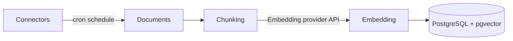
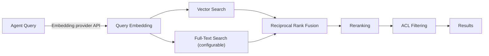

<!--
Check ../docs_writer_prompt.md before changing this file.

-->

The RAG stack runs entirely within PostgreSQL — no external vector database required. See [Platform Deployment — Knowledge Base Configuration](/docs/platform-deployment#knowledge-base-configuration) for full configuration reference.

## Ingestion

Connectors run on a cron schedule, pulling documents that are chunked and embedded into PostgreSQL with pgvector.

## Querying

At runtime, the agent's query is embedded, then vector and optional full-text search run in parallel. Results are fused, reranked, and filtered before being returned.

