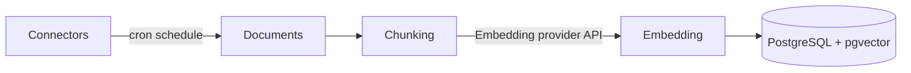
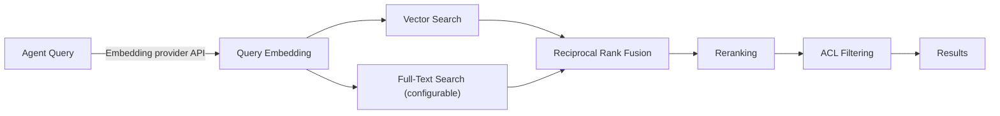

<!--
Check ../docs_writer_prompt.md before changing this file.

-->

Knowledge bases provide built-in retrieval augmented generation (RAG) powered by PostgreSQL and pgvector. Connectors sync data from external tools into knowledge bases, where documents are chunked, embedded, and indexed for hybrid search. Agents automatically query their assigned knowledge sources at runtime.

> **Enterprise feature.** Knowledge bases require an enterprise license. Contact sales@archestra.ai for licensing information.

## Architecture

The RAG stack runs entirely within PostgreSQL — no external vector database required. See [Platform Deployment — Knowledge Base Configuration](/docs/platform-deployment#knowledge-base-configuration) for full configuration reference.

### Ingestion

Connectors run on a cron schedule, pulling documents that are chunked and embedded into PostgreSQL with pgvector.

### Querying

At runtime, the agent's query is embedded, then vector and optional full-text search run in parallel. Results are fused, reranked, and filtered before being returned.

## Knowledge Settings

Embedding and reranking are configured in **Settings > Knowledge** by selecting existing LLM Provider Keys. Both must be configured before knowledge bases and connectors can be used.

### Embedding

The embedding model can be any synced model with embedding dimensions configured in **LLM Providers > Models**. The selected API key must expose at least one such model.

The embedding model is locked after it has been saved. Changing it requires dropping the embedding configuration and re-embedding documents.

### Reranking

The reranker uses an LLM to score and reorder search results by relevance. Any synced chat model can be used. In practice, the model should support structured output.

## Connectors

Connectors pull data from external tools (Jira, Confluence, etc.) on a schedule. Each connector tracks a checkpoint for incremental sync -- only changes since the last run are processed. A connector can be assigned to multiple knowledge bases.

See [Knowledge Connectors](/docs/platform-knowledge-connectors) for supported connector types, configuration, and management.

### Sync Behavior

Connector sync has two simple phases:

1. **Ingestion**: pull new or changed source documents and chunk them.
2. **Embedding**: generate vectors for those chunks so the content becomes searchable.

Syncs can start on schedule or manually. Archestra prevents overlapping runs for the same connector, keeps an incremental checkpoint, and resumes large syncs from the last saved position instead of starting over.

In practice this means:

- new documents are inserted, chunked, and embedded
- unchanged documents are skipped
- changed documents are reprocessed so search stays current
- large syncs can continue over multiple runs without losing progress

Use **Force Re-sync** when you want to clear the checkpoint and rebuild the indexed content from the beginning.

## Assigning Knowledge Bases

Knowledge bases can be assigned to Agents and MCP Gateways. An Agent can have multiple knowledge bases, and a knowledge base can be shared across agents.

A knowledge base is a collection of connectors. For example, a single team knowledge base might combine:

- Jira connectors for that team's boards
- Confluence connectors for that team's spaces
- GitHub connectors for that team's issues and pull requests

That same knowledge base can then be reused across multiple Agents and MCP Gateways. Visibility still comes from each individual connector, so access is determined by the connectors that contribute data, not by a separate visibility setting on the knowledge base itself.

### Visibility Modes

| Mode                      | Behavior                                                        |
| ------------------------- | --------------------------------------------------------------- |
| **Org-wide**              | All documents accessible to all users in the organization       |
| **Team-scoped**           | Documents accessible only to members of the assigned teams      |
| **Auto-sync permissions** | ACL entries synced from the source system (user emails, groups). *Coming soon — see [#3218](https://github.com/archestra-ai/archestra/issues/3218).* |

Source visibility determines which connector data each user can retrieve when an Agent or MCP Gateway calls `query_knowledge_sources`.

Archestra also keeps the rest of the product aligned with that same access model:

- The Knowledge Bases and Connectors pages only show sources the current user can see
- Agent and MCP Gateway configuration only allows assigning visible sources

Users with `knowledgeSource:admin` can view and query all knowledge bases and connectors regardless of org or team scope.

### Practical Example

Suppose you have two Confluence connectors:

- `Engineering Confluence` syncing spaces like `ENG` and `ARCH`, visible to the Engineering team
- `Support Confluence` syncing spaces like `SUP` and `HELP`, visible to the Support team

Both connectors can feed the same knowledge base, but visibility is still enforced per connector.

At query time:

- an Engineering user only retrieves chunks from the Engineering connector
- a Support user only retrieves chunks from the Support connector
- a user with access to both teams can retrieve from both connectors
- a user with `knowledgeSource:admin` can retrieve from both regardless of team assignment

This means you can keep one shared retrieval setup while still preventing users from seeing documents that came from connectors outside their allowed team scope.
