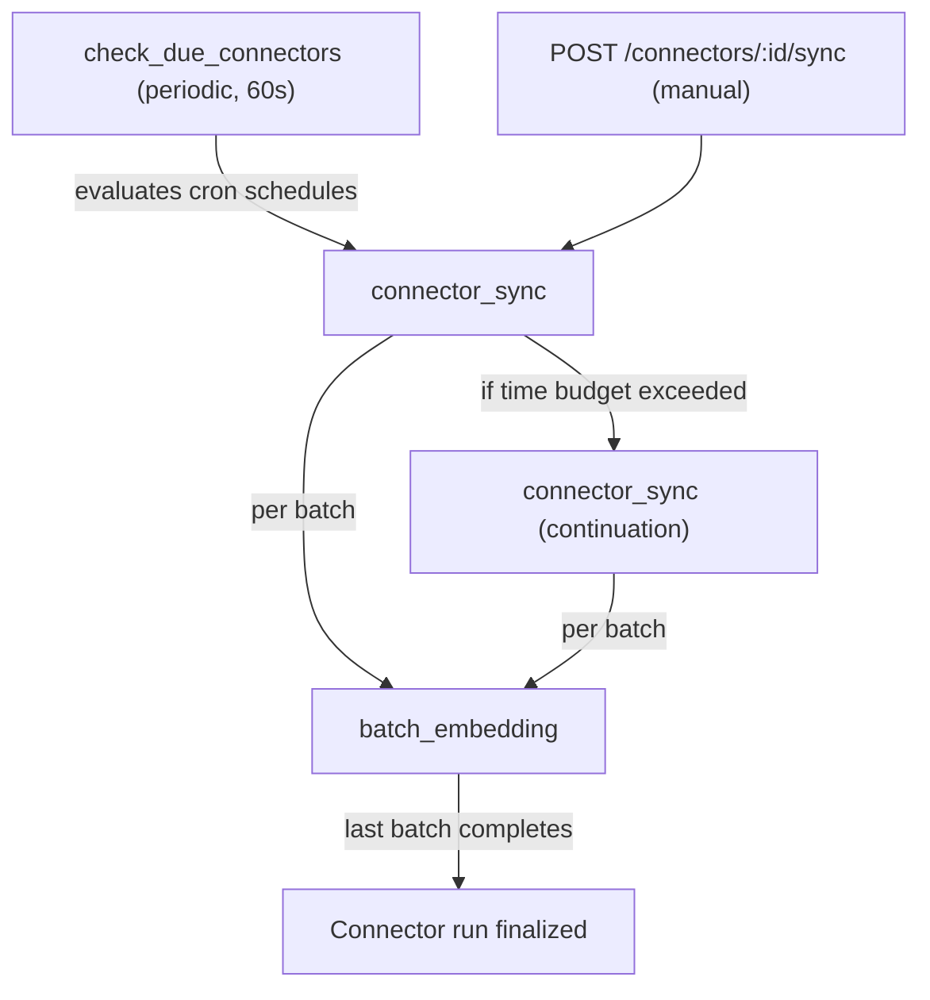

<!--
Check ../docs_writer_prompt.md before changing this file.

This is a developer reference for the internal sync pipeline. It covers task orchestration, data flow, state transitions, and database tables.
-->

## Sync Pipeline Overview

A connector sync moves data from an external tool into searchable vector chunks. The pipeline has three stages: **scheduling**, **ingestion**, and **embedding**.



In practice:

- scheduled syncs are picked up by a periodic scheduler
- manual syncs enqueue the same pipeline immediately
- ingestion stores new or changed documents
- embedding converts document chunks into vectors for search
- long-running syncs continue automatically from their last checkpoint

## How Syncs Start

Syncs start in one of two ways:

- on schedule, when the connector's cron expression becomes due
- manually, when a user triggers **Sync now**

Both paths feed into the same ingestion and embedding pipeline. Archestra prevents overlapping sync runs for the same connector.

## What Gets Processed

Connectors are incremental. Archestra tracks a checkpoint for each connector and only processes changes since the previous successful position.

During ingestion:

- new documents are stored and chunked
- unchanged documents are skipped
- changed documents are reprocessed so search stays current

After chunking, embedding jobs generate vectors for those chunks so the content becomes available to retrieval and reranking.

## Long-Running Syncs

Large syncs are time-bounded. When a run approaches its execution limit, Archestra saves its checkpoint, marks the run as `partial`, and enqueues a continuation job.

This lets large sources finish over multiple runs without losing progress. The continuation resumes from the last saved checkpoint rather than restarting from the beginning.

## State Transitions

### Connector `last_sync_status`

```
null ──> "running" ──> "success"
                   ──> "completed_with_errors"
                   ──> "partial" ──> (continuation) ──> "running" ...
                   ──> "failed"
```

Meaning of the main statuses:

- `running`: a sync is in progress
- `success`: the sync finished cleanly
- `completed_with_errors`: the sync finished, but some items failed
- `partial`: the sync paused and scheduled a continuation
- `failed`: the sync could not complete

## Manual Sync

When you trigger **Sync now**, Archestra immediately marks the connector as `running` and enqueues the same pipeline used for scheduled syncs. The UI then polls for progress and final status updates.

## Force Re-sync

Force Re-sync clears the connector checkpoint and starts the sync from the beginning. Use it when the source system changed in a way incremental sync will not pick up, or when you want to rebuild the connector's indexed content from scratch.

## Document Deduplication

Documents are tracked per connector and source item. On each sync:

- If no existing document: insert, chunk, and embed.
- If existing document with same `content_hash`: skip entirely.
- If existing document with different `content_hash`: update content, delete old chunks, re-chunk, and re-embed.
